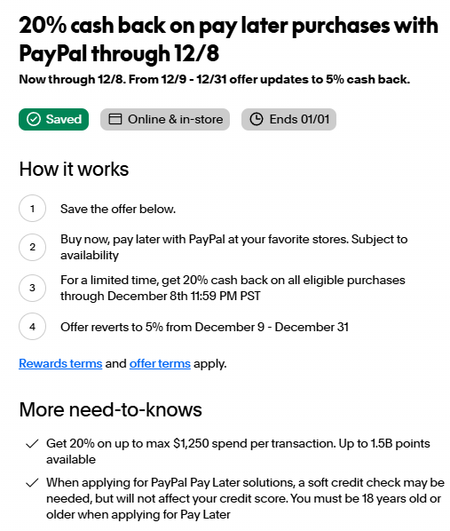
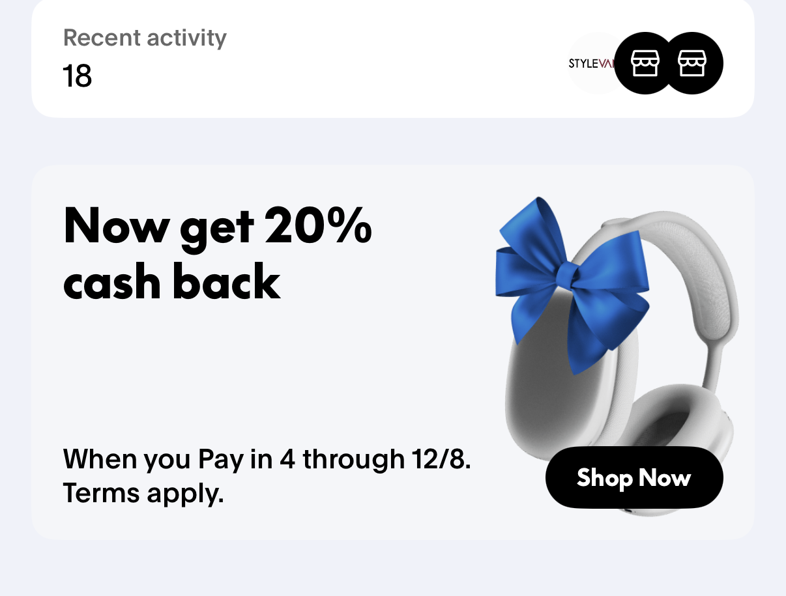
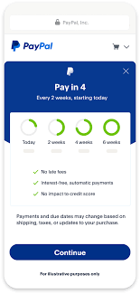
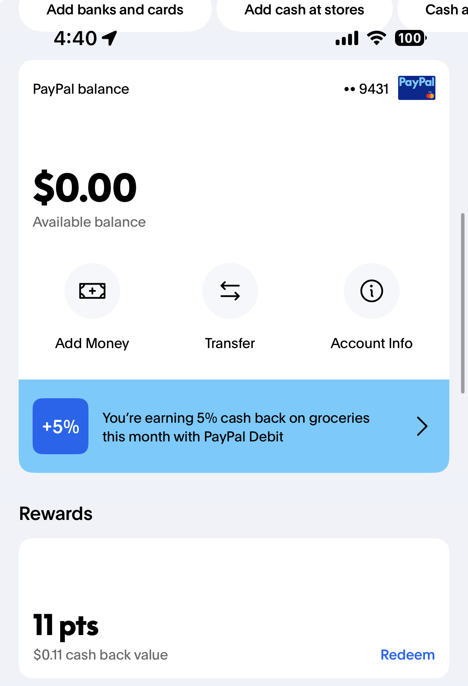
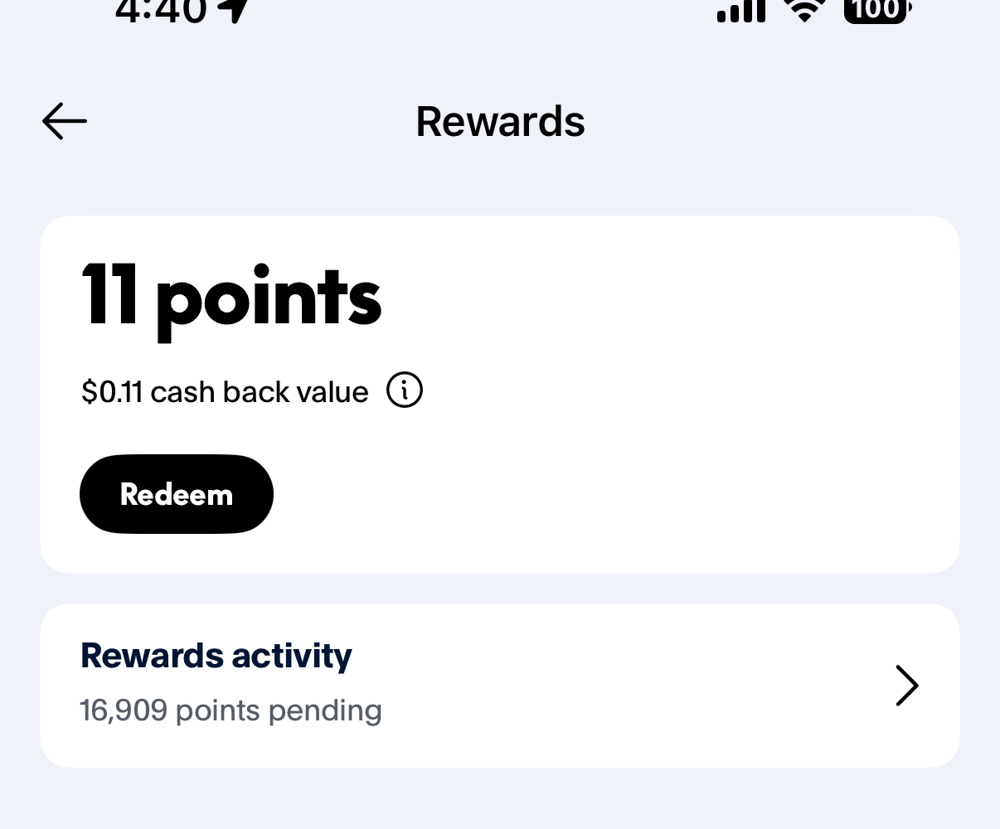
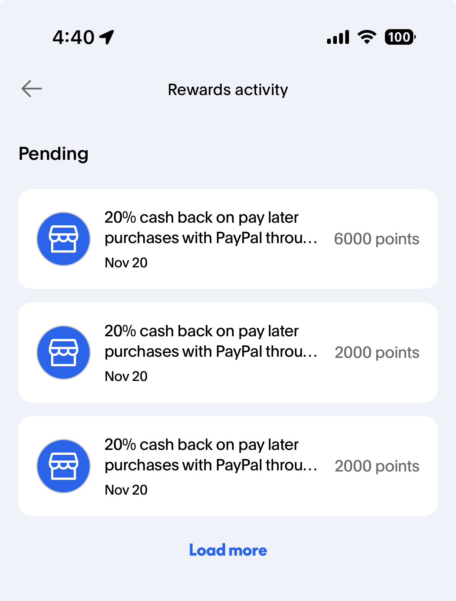

# Check PayPal

[Website Reference](https://www.doctorofcredit.com/targeted-paypal-20-cashback-when-you-pay-in-4/)

Go to PayPal, going up and down, should be able to see the "20% back" on your homepage, save it, like below:

# When Buying

Go to Best Buy, when checking out, use "PayPal" option, BUT DO NOT SELECT ONE PAYMENT, instead, look up and down and find "Pay in 4" and select one card for that "Pay in 4" option. If it is a $100 purchase, it should give you a page like this:

# Pay

Once you process the order, go to your paypal, you can pay the whole thing off early if you want. In the "Accounts - Rewards," you should be able to see many points pending.

