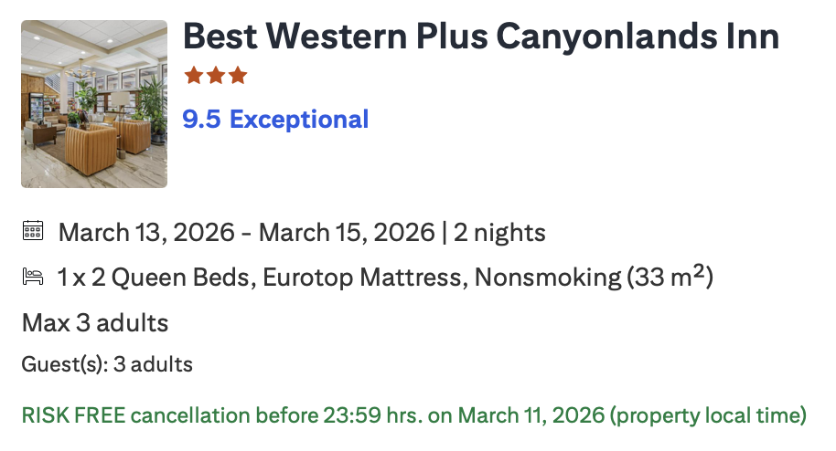
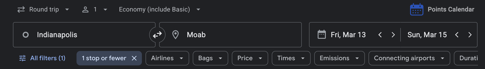

If things are too expensive and it is not worth it to fly out for hours and only stay one day for the national park, we can also do another time.

Coz looking at the price, I feel like it migjt not be worth it 🥹😭 Maybe you can take Ashley somewhere else for a small celebration of MCAT?

# Hotel Booked

# Flight Info

# My plan

- MSP - GJT (Grand Junction): Arrive at March 6, 2026 12:00PM
- GJT - MSP: Depart at March 17, 2026 7PM

So I will be there, with a rental car, throughout your time there. Pick anytime to arrive and depart that works for you! Also, feel free to adjust dates, we can alwasys book one or two more nights if needed.

The major activities are [Arches National Park (one day or two days)](https://www.utah.com/destinations/national-parks/arches-national-park/) and [Canyonlands National Park (one day or two days)](https://noahlangphotography.com/blog/best-things-to-do-canyonlands-national-park). So, if we want to spend 4 days, we could :)